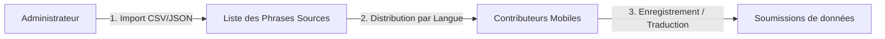

# Cahier des Charges - Dashboard Administrateur Lambdata

Ce document définit les spécifications fonctionnelles et techniques pour le futur **Dashboard Administrateur** de la plateforme Lambdata. Ce dashboard permettra de piloter les campagnes de collecte, de modérer les contributions, de valider les récompenses financières (Mobile Money) et d'exporter les corpus de données IA consolidés.

---

## 🎯 Objectifs du Dashboard Administrateur

1.  **Piloter les campagnes de collecte** : Injecter de nouvelles phrases et images sources pour orienter le travail des contributeurs.
2.  **Garantir la qualité des données** : Suivre le consensus communautaire (reviews) et arbitrer les cas litigieux ou signalés.
3.  **Gérer l'économie de la plateforme** : Valider et traiter les demandes de paiement des contributeurs (XOF).
4.  **Extraire les corpus d'entraînement IA** : Exporter les jeux de données nettoyés et validés dans des formats standards (JSON, CSV, ZIP).

---

## 📋 Spécifications Fonctionnelles (Par Module)

### 1. Vue d'Ensemble & Analytics (Tableau de Bord)
*   **KPIs Globaux** : Nombre total d'utilisateurs actifs, total des contributions par type (Audio, Image, Traduction), taux de validation moyen.
*   **Graphiques de Tendance** : Évolution temporelle des contributions et des inscriptions d'utilisateurs.
*   **Distribution Linguistique** : Répartition des données collectées par langue africaine (Wolof, Bambara, Dioula, etc.).
*   **Alertes** : Signalements de triche ou de comportements suspects, demandes de paiement en attente.

### 2. Gestion des Campagnes de Collecte (Curriculum)
*   **Gestion des Phrases (`TaskPhrase`)** :
    *   Interface d'importation de phrases en masse (via fichier CSV/JSON) pour la collecte vocale (`AUDIO`) et la traduction (`TRANSLATION`).
    *   Filtrage par langue, thématique (santé, agriculture, vie quotidienne) et statut (actif/inactif).
*   **Gestion des Images** :
    *   Téléversement d'images de référence pour les campagnes de labellisation et de validation.
    *   Définition des tags requis et des questions associées à chaque image.

### 3. Modération & Consensus de Validation
*   **Suivi des Validations (`Review`)** :
    *   Visualisation des contributions ayant obtenu le plus d'accords (`ReviewVote.YES`) ou de désaccords (`ReviewVote.NO`).
    *   Interface de décision pour les contributions signalées (`FLAGGED`) par la communauté.
*   **Arbitrage Administrateur** :
    *   Possibilité pour l'administrateur de forcer le statut d'une contribution (`APPROVED`, `REJECTED`) indépendamment du vote communautaire.
    *   Historique des actions de modération.

### 4. Gestion Financière & Récompenses (Paiements Mobile Money)
*   **Suivi des Demandes de Retrait (`Reward`)** :
    *   Liste des demandes de paiement en attente, filtrée par opérateur de Mobile Money (Wave, Orange Money, MTN, Free Money).
    *   Affichage des détails du contributeur : Nom, numéro de téléphone de réception, montant en **XOF** (Franc CFA), niveau et historique de contributions.
*   **Traitement des Paiements** :
    *   Bouton de validation de paiement (avec intégration de passerelles de paiement locales en phase 2).
    *   Suivi des états de transaction : `En attente`, `Payé`, `Rejeté` (avec motif de rejet, ex: fraude détectée).

### 5. Export des Corpus de Données IA (Data Engine)
*   **Moteur d'Exportation Avancé** :
    *   **Filtrage** : Choix du type de contribution, de la langue cible, du niveau de confiance ou du score de qualité minimum (ex: uniquement les audios validés avec un score de qualité > 0.8).
    *   **Formats d'exportation** :
        *   *Textes / Traductions* : Fichiers CSV ou JSON structurés.
        *   *Audio* : Archive ZIP contenant les fichiers `.webm`/`.wav` renommés de manière unique + un fichier d'indexation JSON.
        *   *Images* : Archive ZIP des images labellisées + métadonnées d'annotation.

---

## 🛠️ Stack Technique Recommandée pour le Dashboard

Afin de maintenir la cohérence avec le monorepo actuel de Lambdata, voici la stack technique préconisée :

| Composant | Technologie | Justification |
| :--- | :--- | :--- |
| **Frontend** | **Next.js 15 (React)** | Déjà configuré dans le projet, permet d'utiliser le même design system (Tailwind CSS, shadcn/ui) et évite l'apprentissage d'un nouvel outil. |
| **Authentification**| **Firebase Auth (Rôle Admin)** | Utilisation des *Custom Claims* de Firebase pour octroyer le rôle `admin` aux utilisateurs autorisés et protéger les routes d'API. |
| **Backend API** | **NestJS & Prisma** | Déjà en place dans le dossier `api/`. Les nouveaux contrôleurs admin seront sécurisés par un `AdminGuard` NestJS. |
| **Visualisation** | **Recharts ou Chart.js** | Pour afficher les graphiques de performance de collecte et les analyses de langues. |
